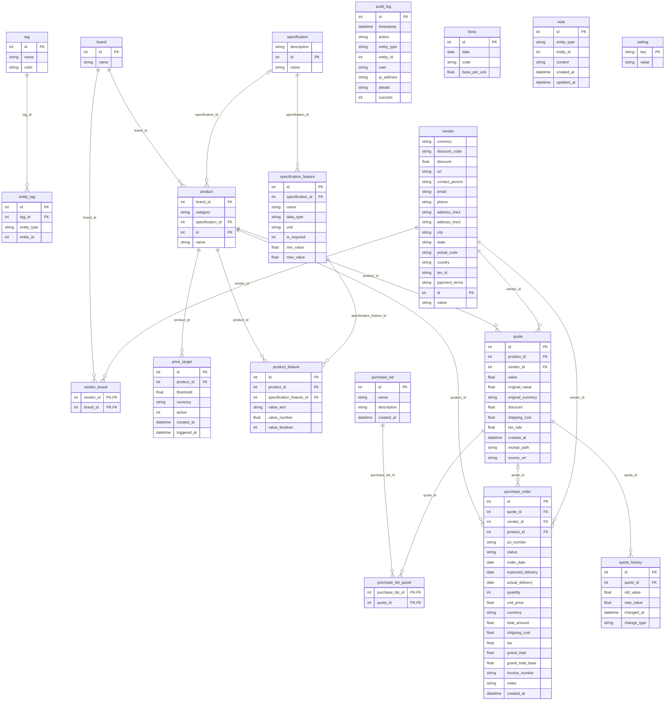

# buylog data model

Generated by `make diagram` (`scripts/gen_diagram.py`). Do not edit by hand.

```mermaid
erDiagram
    tag ||--o{ entity_tag : tag_id
    brand ||--o{ product : brand_id
    specification |o--o{ product : specification_id
    specification ||--o{ specification_feature : specification_id
    brand ||--o{ vendor_brand : brand_id
    vendor ||--o{ vendor_brand : vendor_id
    product ||--o{ price_target : product_id
    product ||--o{ product_feature : product_id
    specification_feature ||--o{ product_feature : specification_feature_id
    product ||--o{ quote : product_id
    vendor ||--o{ quote : vendor_id
    purchase_list ||--o{ purchase_list_quote : purchase_list_id
    quote ||--o{ purchase_list_quote : quote_id
    product ||--o{ purchase_order : product_id
    quote |o--o{ purchase_order : quote_id
    vendor ||--o{ purchase_order : vendor_id
    quote ||--o{ quote_history : quote_id
    audit_log {
        int id PK
        datetime timestamp
        string action
        string entity_type
        int entity_id
        string user
        string ip_address
        string details
        int success
    }
    brand {
        int id PK
        string name
    }
    forex {
        int id PK
        date date
        string code
        float base_per_unit
    }
    note {
        int id PK
        string entity_type
        int entity_id
        string content
        datetime created_at
        datetime updated_at
    }
    purchase_list {
        int id PK
        string name
        string description
        datetime created_at
    }
    setting {
        string key PK
        string value
    }
    specification {
        string description
        int id PK
        string name
    }
    tag {
        int id PK
        string name
        string color
    }
    vendor {
        string currency
        string discount_code
        float discount
        string url
        string contact_person
        string email
        string phone
        string address_line1
        string address_line2
        string city
        string state
        string postal_code
        string country
        string tax_id
        string payment_terms
        int id PK
        string name
    }
    entity_tag {
        int id PK
        int tag_id FK
        string entity_type
        int entity_id
    }
    product {
        int brand_id FK
        string category
        int specification_id FK
        int id PK
        string name
    }
    specification_feature {
        int id PK
        int specification_id FK
        string name
        string data_type
        string unit
        int is_required
        float min_value
        float max_value
    }
    vendor_brand {
        int vendor_id PK,FK
        int brand_id PK,FK
    }
    price_target {
        int id PK
        int product_id FK
        float threshold
        string currency
        int active
        datetime created_at
        datetime triggered_at
    }
    product_feature {
        int id PK
        int product_id FK
        int specification_feature_id FK
        string value_text
        float value_number
        int value_boolean
    }
    quote {
        int id PK
        int product_id FK
        int vendor_id FK
        float value
        float original_value
        string original_currency
        float discount
        float shipping_cost
        float tax_rate
        datetime created_at
        string receipt_path
        string source_url
    }
    purchase_list_quote {
        int purchase_list_id PK,FK
        int quote_id PK,FK
    }
    purchase_order {
        int id PK
        int quote_id FK
        int vendor_id FK
        int product_id FK
        string po_number
        string status
        date order_date
        date expected_delivery
        date actual_delivery
        int quantity
        float unit_price
        string currency
        float total_amount
        float shipping_cost
        float tax
        float grand_total
        float grand_total_base
        string invoice_number
        string notes
        datetime created_at
    }
    quote_history {
        int id PK
        int quote_id FK
        float old_value
        float new_value
        datetime changed_at
        string change_type
    }
```
